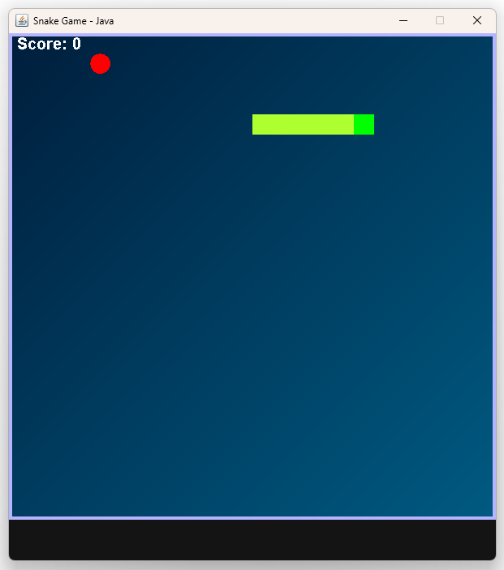
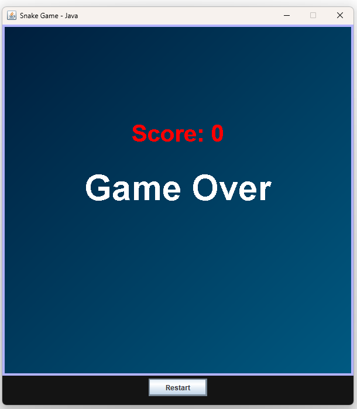
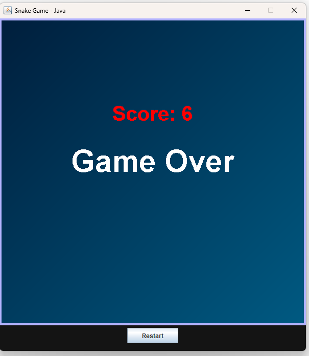

# 🐍 Classic Snake Game – Java Swing Edition

A retro-style **Snake Game** built with **Java Swing**, designed for fun, speed, and simplicity. The game features colorful graphics, a responsive game loop, score tracking, and a **Restart** button.

---

## 🎮 Game Features

- ✅ Classic snake gameplay  
- ✅ Responsive keyboard controls  
- ✅ Score tracking  
- ✅ Game Over & Restart functionality  
- ✅ Colorful background and custom borders  
- ✅ Fully GUI-based using Java Swing  

---
## 📸 Screenshot

---

## 🧩 Requirements

Ensure you have the following installed on your system:

- **Java JDK 8 or higher**  
  [👉 Download JDK](https://www.oracle.com/java/technologies/javase-downloads.html)

- Optional (but helpful):  
  - **DrJava**, **IntelliJ IDEA**, **Eclipse**, or any Java IDE

---
